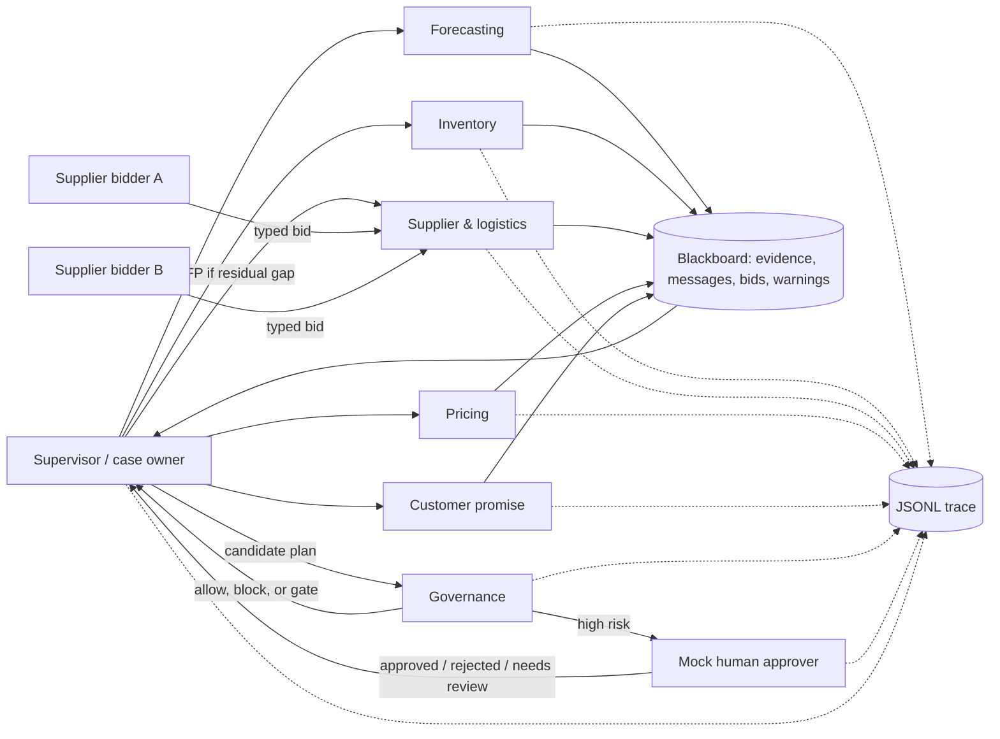

# Stockout Response Multi-Agent System

> A small digital organization that turns a retail demand spike into an auditable, policy-gated response plan - without allowing any agent to touch a real operational system.

This capstone prototype coordinates demand, inventory, supplier/logistics, pricing, customer-promise, governance, and human roles. It is deterministic, local, typed, tested, and trace-first. No API key, LLM call, database, or external service is required.

The design question is intentionally organizational: **how can agents with partial views and conflicting local objectives coordinate without creating a faster mess?**

## Quick start

Python 3.10+ is required.

```bash
cd stockout-mas
python3 -m venv .venv
source .venv/bin/activate
python -m pip install -r requirements.txt
python -m src.run_demo --scenario scenarios/supplier_expedite_required.json
python -m src.run_demo --all
python -m pytest
```

Each run overwrites a stable, reviewable artifact such as `runs/trace_supplier_expedite_required.jsonl`. The tested baseline is **20 passing tests across six scenarios**.

## Executive summary

A store faces possible stockout after a demand spike. Demand can estimate the need but does not know donor inventory. Inventory can find stock but does not know supplier reliability. Supplier/logistics can rank expedites but does not own customer commitments. Pricing sees margin pressure, while customer-promise protects service. Governance is the independent policy authority, and a mocked human holds the final high-risk approval right.

The system can recommend:

- monitor;
- transfer inventory;
- expedite from a supplier;
- pause a promotion;
- protect customer promises;
- escalate to a human.

It cannot execute any of them. Side-effecting tools are dry-run adapters with `executed=false` and a discard token.

### Stakeholders and success

| Stakeholder | Need | Evidence this prototype provides |
|---|---|---|
| Store and supply-chain operator | Restore availability quickly | Forecast, gap, transfer, and bid evidence |
| Finance/pricing | Avoid waste and margin damage | Cost threshold and promotion recommendation |
| Customers | Preserve delivery commitments and trust | Explicit promise-risk check and escalation |
| Donor store/region | Avoid solving one stockout by creating another | Minimum post-transfer service floor |
| Risk/governance | Bound unsafe action | Permission, evidence, price, cost, fairness, and promise checks |
| Human approver | Make a fast, informed decision | Compact approval packet, rationale, rollback story |
| Auditor/course reviewer | Reconstruct what happened | Typed messages, blackboard snapshot data, JSONL trace, tests |

The global objective is to minimize expected lost sales, response cost, promise-breach harm, and unfair inventory concentration, subject to evidence, permission, safety, and approval constraints. This prototype encodes that objective as transparent precedence rules rather than pretending a hand-tuned scalar reward is ground truth.

## Why one agent is not enough

One all-purpose agent would collapse incompatible concerns into an opaque answer. This system instead models a digital organization: separate roles, scoped tools, local objectives, shared evidence, an escalation path, and an independent control function. That follows the course's distinction between a monolithic AI and a governable agent society [CM-MAS, pp. 9-12].

Specialization creates useful disagreement:

- inventory prefers the fastest fair internal transfer;
- logistics balances cost, lead time, capacity, and reliability;
- pricing protects margin but cannot set price;
- customer-promise can force escalation even when inventory economics look good;
- governance can remove one unsafe action while preserving the rest of a plan.

No specialist owns the final decision. The supervisor owns synthesis; governance owns policy; the human owns high-risk approval.

## Architecture



This is a hybrid coordination mechanism:

1. **Supervisor hierarchy** controls order, routing, conflict resolution, and escalation. It limits peer-to-peer message growth and creates one accountable case owner.
2. **Blackboard shared state** externalizes evidence so that agents do not need hidden shared context. It is the reviewable source for synthesis.
3. **Contract Net** allocates the supplier expedite among heterogeneous bids. A manager issues a call for proposals, bidders respond, infeasible bids are removed, and the best feasible bid is recommended.

The hybrid is appropriate because the case needs centralized safety, shared partial evidence, and market-style resource selection. Its trade-off is a deliberate supervisor bottleneck; the bounded local scenario makes that safer than uncontrolled autonomy.

## Agent roster and boundaries

| Role | Local objective | Reads / posts | Tool boundary and authority |
|---|---|---|---|
| Supervisor | Produce the best globally safe response | Reads all blackboard evidence; posts candidate/final plan | Routes and recommends only; cannot mutate operations |
| Forecasting | Estimate seven-day demand and spike | Demand fixture; posts forecast and confidence | Read-only; cannot select inventory, supplier, or price action |
| Inventory | Cover gap with fair internal stock first | Forecast plus inventory fixture; posts shortfall and transfer | Recommend-only; donor floor enforced |
| Supplier/logistics | Select feasible, high-utility expedite | Residual gap and supplier bids; posts ranking | Contract Net manager; cannot place an order |
| Pricing | Protect margin and avoid demand amplification | Shortfall and promotion state; posts recommendation | Cannot change price; aggressive increase is reviewed |
| Customer-promise | Protect committed service | Commitments and proposed recovery; posts risk | Read/recommend-only; can trigger escalation |
| Governance | Enforce global policy and permissions | Evidence plus candidate actions; posts decision | May block or require approval; cannot execute |
| Human approver | Accept risk that policy cannot delegate | Approval packet; posts decision | Final authority for gated plans; simulated here |

The local objectives are intentionally incomplete. Governance and the supervisor reconcile them against company service, cost, fairness, and customer-trust objectives. This makes incentive conflict visible rather than burying it in a prompt.

## Deterministic workflow

1. The supervisor opens a traced case and routes demand assessment.
2. Forecasting posts demand evidence. Missing or low-confidence evidence closes the autonomous path.
3. Inventory computes available units, shortfall, and the best transfer that preserves the donor floor.
4. If a residual gap remains, the supervisor issues a Contract Net call for proposals.
5. Supplier/logistics records each bid, rejects infeasible bids, and posts a scored award recommendation.
6. Pricing and customer-promise independently inspect margin/promotion and service risk.
7. The supervisor assembles candidate actions only from posted evidence.
8. Governance checks evidence, permissions, price, expedite cost, donor fairness, and customer promises.
9. If gated, a typed approval packet goes to the mocked human.
10. Authorized actions are passed only to dry-run adapters; the final plan and run metrics are appended to JSONL.

### Decision policy

| Condition | Response |
|---|---|
| Forecast absent or confidence below policy | No autonomous action; human review |
| Forecast covered by on-hand plus pending | Monitor |
| Fair transfer fully covers gap | Transfer; do not request supplier bids |
| Fair transfer leaves residual gap | Transfer partial quantity, then run Contract Net |
| No feasible bid | Protect promises and/or human review |
| Expedite cost above threshold | Human approval packet |
| Price increase above threshold | Remove price action; retain other safe actions |
| Customer promise still at risk | Human escalation |
| Agent proposes outside its permission | Block that action |

Thresholds live in each scenario's `policy` object rather than being hidden in low-level methods, following the course's configurable-data and precise-design guidance [CM-SE, pp. 5-6].

## Contract Net: a real allocation mechanism

The supplier path is more than choosing the cheapest row.

**Call for proposals.** The supervisor specifies SKU, residual units, maximum lead time, and minimum reliability.

**Feasibility gate.** A bid must satisfy:

```text
capacity >= residual_shortfall
reliability >= policy.min_supplier_reliability
lead_time_days <= policy.max_supplier_lead_days
```

**Ranking.** Feasible bids receive a transparent normalized score:

```text
score = 0.40 * lower_cost
      + 0.35 * shorter_lead_time
      + 0.25 * reliability
```

The trace keeps the CFP, every bid, rejection reasons, weights, ranking, and award recommendation. In `supplier_expedite_required`, cheap `TinyVendor` is rejected for insufficient capacity and `RapidCo` wins the multi-criteria ranking. The supplier action is still only a recommendation.

This implementation covers the course Contract Net sequence and its requirement for bid audit, fairness constraints, escalation, and simulation before production [CM-MAS, pp. 67-73].

## Communication contract

Every inter-agent message validates against `AgentMessage` with `extra="forbid"`. The header includes:

- schema, trace, message, and correlation IDs;
- sender and receiver identity;
- message type, priority, and deadline;
- idempotency key;
- confidence and approval flag;
- payload, status, timestamp, and mock security context.

Example:

```json
{
  "schema_version": "v1",
  "trace_id": "trace-001",
  "message_id": "msg-014",
  "correlation_id": "case-SKU123-2026-06-19",
  "sender_agent": "inventory_agent",
  "receiver_agent": "supervisor_agent",
  "msg_type": "inventory_status",
  "priority": "high",
  "deadline_ms": 5000,
  "idempotency_key": "inventory-SKU123-storeA-001",
  "confidence": 0.91,
  "requires_approval": false,
  "payload": {
    "sku": "SKU-123",
    "store_id": "STORE-A",
    "on_hand": 160,
    "pending_orders": 80,
    "transfer_options": [
      {
        "from_store": "STORE-B",
        "quantity": 120,
        "eta_days": 1
      }
    ]
  },
  "status": "posted"
}
```

Runtime messages additionally carry `timestamp` and `security_context`. Duplicate idempotency keys are ignored and surfaced as a warning. The explicit contract implements the course's principle that the message header is where coordination becomes inspectable [CM-MAS, pp. 53-59].

## Blackboard and evidence

The per-case `Blackboard` stores:

- case metadata and policy version;
- evidence records grouped by agent;
- typed messages and idempotency state;
- proposed actions and supplier bids;
- governance decisions and blocked actions;
- approval packet and human status;
- warnings and failure flags;
- dry-run tool results and discard tokens;
- trace-derived coordination metrics;
- final plan.

The supervisor never finalizes a plan without asking governance to evaluate the shared evidence. Blackboard ownership is per case, avoiding global mutable state and stale evidence leaking across scenarios.

## Safety case

The prototype uses defense in depth rather than trusting a single "safety agent."

### Guardrails in the execution path

| Risk | Preventive or detective control | Safe failure |
|---|---|---|
| Missing/weak forecast | Evidence-presence and confidence policy | Human review only |
| Excessive expedite cost | Configurable financial gate | Approval packet |
| Unsafe price increase | Maximum increase rule | Remove price action |
| Customer promise breach | Quantity and delay check | Escalate |
| Donor-location harm | Post-transfer service floor | Reject transfer option/action |
| Tool overreach | Permission matrix and dry-run adapter | Block or retain recommendation only |
| Duplicate work/replay | Idempotency registry | Ignore duplicate and warn |
| Invalid/unexpected input | Strict Pydantic schemas | Fail validation before workflow |
| Opaque supplier choice | Feasibility reasons and weighted ranking | Trace every bid and decision |
| Lost incident evidence | Append-only-per-run JSONL events | Preserve trace before changes |

Governance is deterministic code outside specialist recommendations. That matters: policy is not merely an instruction that a persuasive agent can reinterpret.

### Identity and trust assumptions

Messages carry named service identities and a mock authentication marker. Within this local prototype, scenario data and bidder identities are trusted fixtures. That is not production authentication.

A production version would require mTLS or workload identity, capability-scoped tokens, tenant checks, encryption, a schema registry, an immutable audit sink, secret management, and bidder authentication. These follow the course security guidance on access control, sensitive data, deserialization, logging, and service identity [CM-SEC, pp. 6-13; CM-MAS, pp. 60, 98].

### Human approval and rollback

The human receives:

- proposed safe actions;
- summarized forecast, inventory, supplier, pricing, and customer evidence;
- governance reasons;
- trace and case IDs;
- a rollback/discard plan.

The human does not receive raw agent chatter. In this prototype, rollback means discarding the recommendation and dry-run tokens because no external system was changed. In production, non-reversible supplier orders would require a transactional outbox, provider cancellation semantics, and a compensating-action playbook before execution was enabled.

## Observability

Every scenario writes newline-delimited `TraceEvent` records with:

- timestamp and trace ID;
- agent and event type;
- message ID when relevant;
- message/payload or decision;
- confidence;
- approval requirement.

Events include case opening, typed messages, evidence posts, CFP/bids, governance checks, human decisions, tool dry-runs, final plan, and completion metrics.

`compute_run_metrics` records:

- messages total and by sender;
- evidence count;
- proposed action mix;
- guardrail blocks and recommendation reversals;
- human escalation count;
- supplier bid count, infeasible count, and cost spread;
- minimum donor service after transfer;
- duplicate messages ignored.

These are the prototype's MAS golden signals: throughput/coordination volume, errors and blocks, cost-related bid behavior, safety escalation, and resource fairness. Stable trace IDs across messages and approval events avoid the course's "detective story" failure mode [CM-MAS, pp. 100, 121-125].

## Incentives and emergence

### Useful expected emergence

- A cheap internal transfer is preferred without a monolithic rule knowing every domain fact in advance.
- Partial transfer and supplier expedite compose into a complete plan.
- Governance can reject only the unsafe price action while preserving a useful inventory response.
- Customer commitments can override a superficially cheap plan.

### Unwanted emergence and controls

| Behavior | Signal | Guardrail / response |
|---|---|---|
| Donor hoarding or regional depletion | `minimum_donor_service_level_after`; later cross-run regional concentration/Gini | Hard donor floor; human review for fairness exceptions |
| Pricing oscillation or escalation | `recommendation_reversals`, price-action frequency | Price ceiling, promotion pause, one supervisor decision per case |
| Supplier collusion or untruthful bidding | Bid cost spread, repeated winner share, reliability misses | Keep all bids; random audit/red-team in a later pilot; human gate |
| Message storm or replay | Messages per sender, duplicate count | Hierarchical routing, bounded sequence, idempotency |
| Local optimization harms customers | Promise-risk and escalation rate | Customer specialist plus governance priority |
| Hidden failure after agent loss | Missing evidence and incomplete handoff | Fail closed; do not synthesize invented evidence |

Some metrics become meaningful only across many runs. This repository emits the required per-run inputs and names the aggregation before claiming the system is safe. The course is explicit that emergence must be measured and deliberately red-teamed [CM-MAS, pp. 39, 44-47, 78-81].

## Evaluation

Run:

```bash
python -m pytest
```

The suite validates:

1. normal demand triggers only monitoring;
2. high stockout risk triggers a response;
3. a sufficient fair transfer avoids a supplier call;
4. Contract Net applies capacity, lead-time, reliability, and cost;
5. an unsafe price action is blocked without discarding a safe transfer;
6. high-cost expedite creates an approval packet;
7. missing forecast evidence refuses autonomous action;
8. every scenario writes a parseable, complete trace;
9. all side-effecting tools remain dry-run;
10. unexpected message fields and duplicate supplier identities fail schema validation.

This spans component validation, interaction/handoff behavior, system scenarios, permission guardrails, and evidence integrity. It does not yet prove business uplift, scale performance, bidder truthfulness, or demographic fairness. Those belong in later digital-twin, red-team, shadow, A/B, and ethics gates, matching the course's multi-layer evaluation model [CM-MAS, pp. 129-140; CM-PROD, pp. 37-47].

### Scenario catalog

| Fixture | Expected safe outcome |
|---|---|
| `normal_demand.json` | Monitor; no transfer, expedite, price action, or approval |
| `transfer_solves_stockout.json` | Fair internal transfer; no supplier request |
| `supplier_expedite_required.json` | Partial transfer, ranked expedite, promotion pause |
| `approval_required_high_cost.json` | High-cost expedite only after simulated approval |
| `unsafe_price_blocked.json` | Remove 25% increase; retain safe transfer |
| `missing_forecast_evidence.json` | Refuse autonomy; human needs more evidence |

## Failure analysis

| Failure mode | Current behavior | Residual risk / next test |
|---|---|---|
| Forecast unavailable | Fail closed and trace failure | Validate freshness and source lineage, not only presence |
| Stale blackboard evidence | New blackboard per case | Add evidence TTLs for long-running cases |
| Duplicate message | Ignore by idempotency key | Persist keys outside process for crash recovery |
| Malicious/Sybil bidder | Fixture identity accepted | Authenticate bidders; inject malicious bidder scenario |
| Collusive bids | Preserve bids and cost spread | Cross-run anomaly rule and random audit |
| Supervisor crash | Trace survives events already written | Checkpoint workflow and support deterministic replay |
| Governance unavailable | Workflow cannot authorize final plan | Explicit fail-closed availability test |
| Human delay | `needs_review`; no external action | Approval SLA and expiry |
| Conflicting specialists | Priority policy plus governance | Add explicit conflict event and review metric |
| Customer heterogeneity | One aggregate commitment segment | Slice service metrics by lawful, relevant subgroups |
| Policy misconfiguration | Typed ranges catch invalid values | Four-eyes policy version approval |
| Real action partially succeeds | Impossible in current dry-run | Transactional adapter, reconciliation, compensation |

The safest property of the prototype is its bounded claim: it demonstrates inspectable coordination, not production autonomy.

## Explainability and fairness

The decision is interpretable by construction. Each action maps to posted evidence and a named rule. The final plan includes plain-language rationale and a factor list for forecast, shortfall, Contract Net score, and governance result. The approval packet is tailored to the decision-maker, aligning with the course view of explanation as an audience-specific interface for appropriate trust [CM-XAI, pp. 3-11].

Fairness here is operational: do not improve one store by pushing a donor below its service floor, and retain region metadata so outcomes can be sliced rather than hidden in an aggregate. This is not a claim of customer demographic fairness. Before production, the team would define lawful protected-group questions, test service and error rates by subgroup, examine temporal/emergent bias, and obtain governance review [CM-FAIR, pp. 4-18].

## MDP vocabulary and the MARL bridge

This workflow can be described without implementing learning:

- **state:** forecast, on-hand, pending inventory, transfers, bids, promotion, promises, policy, approval;
- **action:** monitor, transfer, expedite, pause promotion, protect promises, escalate;
- **policy:** deterministic precedence, Contract Net ranking, and governance constraints;
- **reward/objective:** service and company value minus response cost, promise harm, unfair depletion, and policy violations;
- **transition:** simulated inventory coverage after a proposed action;
- **return:** cumulative outcome across repeated stockout cases;
- **constraints:** evidence, permissions, price, reliability, lead, fairness, cost, and human gates;
- **evaluator:** scenario tests, trace metrics, later business and ethics measures.

MARL is intentionally absent. There is no repeated learning environment, validated reward, delayed production feedback model, or safe digital twin. Other learning agents would make the environment non-stationary, worsen credit assignment, and make local rewards easier to game. A deterministic workflow is enough for the current decision and is required for governance.

MARL could become appropriate only after many stores repeatedly compete for scarce inventory, outcomes can be simulated faithfully, delayed effects matter, and a baseline policy has strong offline evidence. Then a Markov game might use store observations and transfer/request/hold actions with a shared service/profit reward, hoarding and fairness penalties, allocation caps, centralized training, decentralized execution, off-policy evaluation, shadow mode, and human override. No learned policy should approach production before safe simulation and regression gates [CM-MAS, pp. 83-90].

## Repository map

```text
stockout-mas/
├── README.md
├── AGENTS.md
├── requirements.txt
├── pyproject.toml
├── src/
│   ├── schemas.py
│   ├── blackboard.py
│   ├── agents.py
│   ├── tools.py
│   ├── coordinator.py
│   ├── guardrails.py
│   ├── evaluation.py
│   ├── simulator.py
│   ├── tracing.py
│   └── run_demo.py
├── scenarios/
│   └── six deterministic JSON fixtures
├── tests/
│   └── test_scenarios.py
├── docs/
│   └── course_alignment.md
└── runs/
    └── .gitkeep
```

## Rubric evidence

| Grading category | Repository evidence |
|---|---|
| Use-case and stakeholders (4) | Concrete retail event, seven stakeholder needs, bounded action set, explicit success objective |
| Roles and boundaries (5) | Eight narrow roles, local objectives, permission matrix, dry-run tool boundary |
| Protocol and architecture (5) | Pydantic v1 messages, routed hierarchy, blackboard, Contract Net, diagram |
| Coordination and incentives (6) | Precedence policy, bid mechanism, global/local objective tension, emergence metrics/guardrails |
| Prototype/scenario (5) | Runnable CLI, six deterministic fixtures, worked supplier and approval paths |
| Evaluation, observability, safety (6) | 19 tests, JSONL traces, governance policy, HITL packet, rollback, failure table |
| Presentation and clarity (4) | Quick start, architecture map, tables, course crosswalk, `AGENTS.md` |

## Course references

Short references above point to the supplied PDFs:

- **CM-MAS:** `../course materials/multi-agent-systems.pdf`
- **CM-SE:** `../course materials/Software Engineering Best Practices.pdf`
- **CM-PROD:** `../course materials/Real-worldMLInProduction.pdf`
- **CM-SEC:** `../course materials/Securing ML Applications.pdf`
- **CM-XAI:** `../course materials/Model Explainability and Interpretability.pdf`
- **CM-FAIR:** `../course materials/Fairness and Bias in Machine Learning.pdf`

The detailed traceability matrix and deliberate limitations are in [`docs/course_alignment.md`](docs/course_alignment.md).
